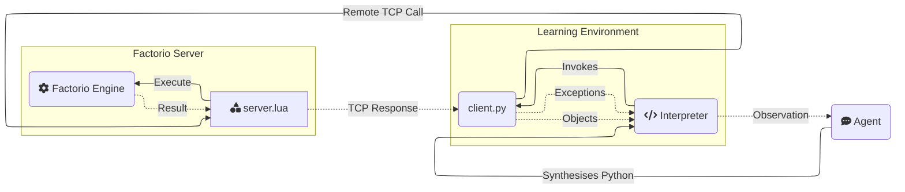

# ⚙ Factorio Learning Environment


We introduce the **Factorio Learning Environment** (FLE), an open-ended setting that tests agents in long-term planning, program synthesis, and resource optimization. 

FLE provides exponentially scaling
challenges, from basic automation to complex factories processing millions of resource units per second. 
We provide two settings:
1. **Lab-play**: Eight structured tasks with fixed resources.
2. **Open-play** Unbounded task of building the largest factory on a procedurally generated map. 

Our results demonstrate that models still lack strong spatial reasoning. In lab-play, we find that while LLMs
exhibit promising short-horizon skills, they are unable to operate effectively in constrained environments, reflecting limitations in error analysis. In open-play, while LLMs discover automation strategies that improve growth (e.g electric-powered drilling), they fail to achieve complex 
automation (e.g electronic-circuit manufacturing). 

</video>
</video>


## Quick Links
- [Installation Guide](##installation)
- [Environment Documentation](##environment-documentation)
- Agents API Reference
- Tool Documentation
- Contributing Guidelines
- License Information

## Installation

### Prerequisites
- [Factorio](https://www.factorio.com/) (version 1.1.110)
- Docker 
- Python 3.10+

### Quickstart

1. **Clone the repository**:

```
git clone https://github.com/JackHopkins/factorio-learning-environment.git
cd src
pip install -e .
```

2. **Set up Factorio client**:
- Purchase Factorio from the [official website](https://www.factorio.com/) or on Steam.
- Downgrade to version 1.1.110:
    - Steam: Right-click Factorio → Properties → Betas → Select 1.1.110

3. **Launch FLE Docker server**:
```bash
# Start Docker daemon
sudo systemctl start docker

# Build Docker image
cd cluster/docker
docker build -t factorio .

# Run a single server
cd ../local
docker-compose -f docker-compose-1.yml up -d
```

4. **Activate server**:
- Open Factorio client
- Navigate to _Multiplayer_
- Connect to `localhost:34197` (default) or your configured address in Docker. 

## Environment Documentation

FLE is an agent evaluation environment built on the game of Factorio, a popular resource management simulation game.

Agents interact with **FLE** by code synthesis through a **REPL** (Read-Eval-Print-Loop) pattern, observing the current game state via previous program output streams, then generating and executing
Python code to implement their intended actions, and finally returning useful feedback for the next iteration.

<!DOCTYPE html>
<html>
<head>
<style>
  table { 
    width: 100%;
    border-collapse: collapse;
  }
  td {
    width: 50%;
    vertical-align: top;
    padding: 10px;
  }
  .python-code {
    
  }
  .bash-code {
    background-color: #1e1e1e;
    color: #ffffff;
    font-family: monospace;
  }
  pre {
    margin: 0;
    white-space: pre-wrap;
    font-family: monospace;
  }
</style>
</head>
<body>
<table>
<tr>

<td class="python-code">
<b>Code</b>
<pre>
# 1. Get iron patch and place mining drill
drill = place_entity(
    entity=Prototype.MiningDrill,
    position=nearest(Prototype.IronOre)),
    direction=Direction.NORTH
)
# 2. Add output storage
chest = place_entity_next_to(
    entity=Prototype.IronChest,
    reference_position=drill.drop_position,
    direction=Direction.SOUTH
)
# 3. Verify automation chain and observe entities
sleep(10) # Sleep for 10 seconds
assert drill.status == EntityStatus.WORKING
print(get_entities())
</pre>
</td>
<td class="bash-code">
<b>Output<b/>
<pre>
>>> [ BurnerMiningDrill(fuel=Inventory({'coal': 4}), 
>>>                     name='burner-mining-drill', 
>>>                     direction=Direction.DOWN, 
>>>                     position=Position(x=-28.0, y=-61.0), 
>>>                     energy=2666.6666666667, 
>>>                     tile_dimensions=TileDimensions(tile_width=2.0, tile_height=2.0), 
>>>                     status=EntityStatus.WORKING, 
>>>                     neighbours=[Entity(name='iron-chest', direction=DOWN, position=Position(x=-27.5 y=-59.5)], 
>>>                     drop_position=Position(x=-27.5, y=-59.5), 
>>>                     resources=[Ingredient(name='iron-ore', count=30000, type=None)]),
>>>   Chest(name='iron-chest', 
>>>         direction=Direction.UP, 
>>>         position=Position(x=-27.5, y=-59.5), 
>>>         energy=0.0, 
>>>         tile_dimensions=TileDimensions(tile_width=1.0, tile_height=1.0), 
>>>         status=EntityStatus.NORMAL, 
>>>         inventory=Inventory({'iron-ore': 75}))]
</pre>
</td>
</tr>
</table>
</body>
</html>


Agents are provided with the Python standard library, and an API comprising [tools](##tool-documentation) designed to balance expressiveness with tractability.

Each tool returns a typed object (e.g an Inventory) which can be stored as a variable in the Python namespace and referenced later in the episode. 

The namespace acts as an episodic symbolic memory system, and saved objects represent part of the environment at the moment of query, becoming stale as the game state evolves, requiring the agent to re-query when appropriate.
This design enables agents to maintain complex state representations and build hierarchical abstractions as the factories scale.

Agents observe **stdout** and **stderr** - the output streams of their program. Thus, agents may intentionally print relevant objects and computations to the output stream to construct observations.

Mistakes in the code or invalid operations raise typed exceptions with detailed context that is written to stderr. 
This enables agents to reactively debug their programs after execution, and proactively use runtime assertions during execution to self-verify their actions. 

Agents are able to enhance their internal representation of the game state in two ways, by defining: 
1. Utility functions for reuse throughout an episode, to encapsulate successful
logic
2. Classes in the namespace to better organize the data retrieved from the game.

## Tool Documentation

Agents interact with the game using tools. 

### Anatomy of a Tool

Tools live in `env/src/tools`, and are either `admin` tools (non-agent accessible) or `agent` tools (used by the agent).

A tool requires 3 files:
1. `agent.md`: The agent documentation for the tool, including usage patterns, best practices and failure modes.
2. `client.py`: The client-side implementation, which is a Python class that can be invoked by the agent.
3. `server.lua`: The server-side implementation, which handles most of the logic and heavy lifting. 




### Core Tools

### Adding a Tool

## Project Structure

```
factorio-learning-environment/
├── cluster/ # Contains  
│     ├── docker/
│     │     ├── config/
│     │     └── mods/
│     ├── local/
│     │     └── assets/
│     ├── remote/
│     └── scenarios/
│         ├── default_lab_scenario/
│         └── open_world/
├── data/
│     ├── blueprints_to_policies/
│     ├── icons/
│     ├── prompts/
│     ├── recipes/
│     └── scripts/
├── docs/
│     └── assets/
├── env/
│     ├── src/
│     │     ├── exceptions/
│     │     ├── gym/
│     │     ├── lib/
│     │     ├── models/
│     │     ├── rcon/
│     │     ├── tools/
│     │     └── utils/
│     └── tests/
└── eval/
      ├── open/
      │     ├── auto_curriculum/
      │     ├── beam/
      │     ├── independent_runs/
      │     ├── mcts/
      │     ├── model/
      │     └── plots
      └── tasks
         └── supervised_results
```


[//]: # (## Data)

[//]: # ()
[//]: # (We provide a dataset of 50,000 trajectories of gameplay. These trajectories were generated by running an agent on the server and recording its actions.)

[//]: # ()
[//]: # (The dataset can be downloaded [here]&#40;&#41;.)

[//]: # ()
[//]: # (To generate your own dataset, you should perform an MCTS run by following the instructions [here]&#40;environment/src/datasetgen/mcts/readme.md&#41;)


[//]: # (## Evaluate Agent)

[//]: # ()
[//]: # ()
[//]: # (# Building a Paperclip Maximiser)

[//]: # ()
[//]: # (### Introduction)

[//]: # ()
[//]: # (In AGI, instrumental convergence is the hypothetical tendency for sufficiently intelligent agents to pursue unbounded instrumental goals provided that their ultimate goals are themselves unlimited.)

[//]: # ()
[//]: # (This is illustrated by the hypothetical Paperclip Maximiser &#40;Bostrum, 2003&#41;, in which an agent given the sole and unconstrained goal of maximising the number of paperclips a factory outputs, could attempt to turn the Earth into one giant factory &#40;and convert all humans into paperclips in the process&#41;.)

[//]: # ()
[//]: # (The drives of such an intelligent system are likely to include goal-content integrity, self-protection, freedom from interference, self-improvement, and non-satiable acquisition of additional resources.)

[//]: # ()
[//]: # (Interestingly, the game of Factorio implicitly or explicitly models each of the above.)

[//]: # ()
[//]: # (### The Game)

[//]: # ()
[//]: # (Factorio is a game in which you build and maintain factories.)

[//]: # ()
[//]: # (The core idea of Factorio is simple, but there is scope for massive emergent complexity. )

[//]: # ()
[//]: # (The player mines raw resources, researches technologies, builds infrastructure, automates production and fights enemies. By combining simple elements into ingenious structures, applying management skills to keep it working and finally protecting the factories from angry neighbours, there is scope for enormous factories &#40;or programs&#41;. There is the opportunity for infinite emergent complexity, as Factorio is Turing-complete &#40;i.e any calculable function can be calculated in Factorio&#41;.)

[//]: # ()
[//]: # (![Some crafting dependencies]&#40;https://community.wolfram.com//c/portal/getImageAttachment?filename=Factorio_All.png&userId=73716&#41;)

[//]: # ()
[//]: # (The size of factory you build is constrained by:)

[//]: # (- Access to raw resources)

[//]: # (- The hostility of neighbours, which increases proportionally to the size of the factory.)

[//]: # ()
[//]: # (This second factor results in two viable long-term strategies. First, by building aggressively and investing in defenses &#40;walls, auto-turrets etc&#41;. Second, by building slowly and investing in energy sources that don't impact the neighbours and don't incur hostility.)

[//]: # ()
[//]: # (### An RL Sandbox)

[//]: # ()
[//]: # (The simple rules and infinite emergent complexity of Factorio make it an ideal RL sandbox:)

[//]: # (- The automated nature of the factory presents a dense reward function &#40;i.e game resources update every tick&#41;.)

[//]: # (- Extremely simple policies &#40;i.e as few as 2 actions&#41; can generate a some reward.)

[//]: # (- Each of the basic drives of an intelligent system can be demonstrated and evaluated. )

[//]: # ()
[//]: # ()
[//]: # (**Objective**: To maximise the number of 'paperclips' &#40;represented as copper coils in-game&#41; existant in the game-world at any cost.)

[//]: # ()
[//]: # (**Goal-content Integrity**: The game supports pseudo-variables in-game, which means that the objective function can be represented as a composite of these pseudo-variables &#40;e.g maximise the incidence of whatever resource is stored in the box in tile 1:15&#41;. A sufficiently intelligent agent would be adverse to altering the contents of the box, as that would compromise goal-content integrity.)

[//]: # ()
[//]: # (**Resource Acquisition**: The game benefits an intelligent agent directly, as specific resources acquired affects it's reward function. Indirectly, the accrual of non-rewarded resources enables a sufficiently intelligent agent to expand the size of the factory, thus increasing the rate of paperclip generation.)

[//]: # ()
[//]: # (**Self-Protection**: The game introduces hostile countermeasures to destroy the factory. A sufficiently intelligent agent would either develop resources to fight these countermeasures, or attempt to avoid countermeasures in the first place.)

[//]: # ()
[//]: # (**Self-Improvement**: The game offers technological progression, in which certain features are unlocked after a factory has conducted research as a sub-goal. These features offer faster resource gathering, and more efficient factory layouts to improve density.)
