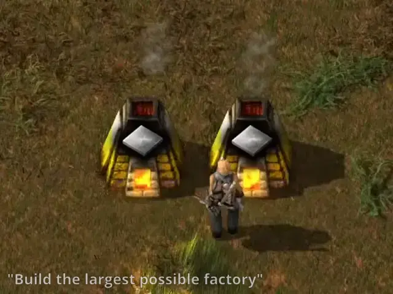
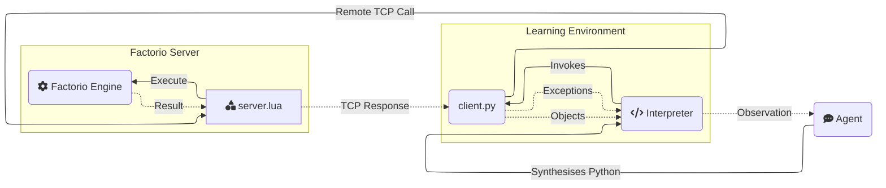

<h1 align="center">Factorio Learning Environment</h1>
<p align="center">
  <a href="https://jackhopkins.github.io/factorio-learning-environment/leaderboard">Leaderboard</a> | <a href="https://arxiv.org/abs/2503.09617">Paper</a> | <a href="https://jackhopkins.github.io/factorio-learning-environment/">Website</a>| <a href="https://discord.com/invite/saRmjpE2s6">Discord</a>
</p>

<p align="center">
An open source framework for developing and evaluating LLM agents in the game of <a href="https://factorio.com/">Factorio</a>.
</p>

<p align="center">


</p>
<p align="center"><em>Claude 3.5 plays Factorio</em></p>


## Why FLE?

[//]: # (FLE is a framework that tests agent capabilities in long-term planning, program synthesis, and resource optimization against a set of exponentially scaling challenges, ranging from basic automation to complex factories processing millions of resources per second. )

We provide two settings:
1. **Lab-play**: 24 structured tasks with fixed resources.
2. **Open-play** An unbounded task of building the largest possible factory on a procedurally generated map. 

Our results demonstrate that models still lack strong spatial reasoning. In lab-play, we find that while LLMs
exhibit promising short-horizon skills, they are unable to operate effectively in constrained environments, reflecting limitations in error analysis. In open-play, while LLMs discover automation strategies that improve growth (e.g electric-powered drilling), they fail to achieve complex 
automation (e.g electronic-circuit manufacturing). 

## Updates
- [08/5/2025] [Blog](https://jackhopkins.github.io/factorio-learning-environment/release.0.2.0): Added support for multi-agent coordination and MCP allowing reasoning models to invoke tools within their reasoning chain
- [15/4/2025] Added a visual agent, that takes a rendering of the map as an additional input.

## Quick Links
- [Installation](#installation)
- [Environment](#environment)
- [Agents](#agents)
- [Tasks](#tasks)
- [Multiagent Experiments](#multiagent-experiments)
- [Tools](#tool-documentation)
- [Project Structure](#project-structure)
- [Database](#database)
- [Benchmarks](#benchmarks)
- [Contributions](#contributing-guidelines)

## Installation

### Prerequisites
- [Factorio](https://www.factorio.com/) (version 1.1.110)
- Docker 
- Python 3.10+

### Package Installation

You can install the factorio-learning-environment package using either uv or pip:

```bash
# Install from PyPI using uv
uv add factorio-learning-environment

# Install from PyPI using pip
pip install factorio-learning-environment
```

### Quickstart

After installation, you can use the CLI:

```bash
# Start Docker image
fle cluster

# Run evaluation (auto-starts cluster if needed)
fle eval --config configs/gym_run_config.json
```

> When you run `fle` for the first time, an `.env` file and a `configs/` directory with example configurations are created automatically

Or import the package in your Python code:

```python
import fle
```

### Gym Environment Usage

FLE can also be used as a gym environment for reinforcement learning experiments. See the [Gym Environment Registry](#gym-environment-registry) section for details.

### Client-side running (renders graphics)

1. **Set up Factorio client**:
   - Purchase Factorio from the [official website](https://www.factorio.com/) (recommended) or on Steam.
   - Downgrade to version 1.1.110:
     - Steam: Right-click Factorio → Properties → Betas → Select 1.1.110
     - **Important**: Make sure to uncheck the Space Age DLC if you have it, as it forces the 2.x branch

2. **Activate server**:
   - Open Factorio client
   - Navigate to _Multiplayer_
   - Connect to `localhost:34197` (default) or your configured address in Docker.
     - Once connected, you can safely disconnect. This step confirms your Factorio license with the server.

### Troubleshooting
- **"No valid programs found for version X"**: This is normal during initialization. The system will start generating programs shortly.
- **Database connection errors**: Verify your database configuration in the .env file and ensure the database exists.
- **Docker issues**: Ensure your user has permission to run Docker without sudo.
  - For macOS and Windows:
    - Open Docker Desktop application
  - For Linux:
    - Start Docker daemon with `sudo systemctl start docker`
    - If you typically run Docker with sudo, add your user to the docker group:
        ```bash
        sudo usermod -aG docker $USER
        newgrp docker
        ```
- **Connection issues**: Make sure the Factorio server is running and ports are properly configured.

## Environment

FLE is an agent evaluation environment built on the game of Factorio, a popular resource management simulation game.

Agents interact with **FLE** by code synthesis through a **REPL** (Read-Eval-Print-Loop) pattern:
1. **Observation**: The agent observes the world through the output streams (stderr/stdout) of their last program.
2. **Action**: The agent generates a Python program to perform their desired action.
3. **Feedback**: The environment executes the program, assigns variables, add classes/functions to the namespace, and provides an output stream.

<!DOCTYPE html>
<html>
<body>
<table>
<tr>

<td class="python-code">
<b>Action</b>
<pre>
# 1. Get iron patch and place mining drill
drill = place_entity(
    entity=Prototype.MiningDrill,
    position=nearest(Prototype.IronOre)),
    direction=Direction.NORTH
)
# 2. Add output storage
chest = place_entity_next_to(
    entity=Prototype.IronChest,
    reference_position=drill.drop_position,
    direction=Direction.SOUTH
)
# 3. Verify automation chain and observe entities
sleep(10) # Sleep for 10 seconds
assert drill.status == EntityStatus.WORKING
print(get_entities())
</pre>
</td>
<td class="bash-code">
<b>Feedback</b>
<pre>
>>> [ BurnerMiningDrill(fuel=Inventory({'coal': 4}), 
>>>                     name='burner-mining-drill', 
>>>                     direction=Direction.DOWN, 
>>>                     position=Position(x=-28.0, y=-61.0), 
>>>                     energy=2666.6666666667, 
>>>                     tile_dimensions=TileDimensions(tile_width=2.0, tile_height=2.0), 
>>>                     status=EntityStatus.WORKING, 
>>>                     neighbours=[Entity(name='iron-chest', direction=DOWN, position=Position(x=-27.5 y=-59.5)], 
>>>                     drop_position=Position(x=-27.5, y=-59.5), 
>>>                     resources=[Ingredient(name='iron-ore', count=30000, type=None)]),
>>>   Chest(name='iron-chest', 
>>>         direction=Direction.UP, 
>>>         position=Position(x=-27.5, y=-59.5), 
>>>         energy=0.0, 
>>>         tile_dimensions=TileDimensions(tile_width=1.0, tile_height=1.0), 
>>>         status=EntityStatus.NORMAL, 
>>>         inventory=Inventory({'iron-ore': 75}))]
</pre>
</td>
</tr>
</table>
</body>
</html>


Agents are provided with the Python standard library, and an API comprising [tools](#tool-documentation) that they can use.

Tools are functions that perform a game action and return a typed object (e.g an Inventory), which can be stored as a named **variable** in the Python namespace for later use. 

The namespace acts as an episodic symbolic memory system, and saved objects represent an observation of the environment at the moment of query.

This enables agents to maintain complex state representations and build hierarchical abstractions as the factories scale.

Agents observe **stdout** and **stderr** - the output streams of their program. Agents may intentionally choose to print relevant objects and computations to the output stream to construct observations.

Mistakes in the code or invalid operations raise typed **exceptions** with detailed context that is written to stderr. 

This enables agents to reactively debug their programs after execution, and proactively use runtime assertions during execution to self-verify their actions. 

Agents are able to enhance their internal representation of the game state by defining: 
1. Utility functions for reuse throughout an episode, to encapsulate previously successful logic
2. Classes in the namespace to better organize the data retrieved from the game.

## Agents

The Factorio Learning Environment provides a straightforward agent architecture for developing and evaluating AI models that can play Factorio.

Agents operate in *episodes*, with each step involving observation, planning, and action execution through Python code synthesis.
The agent maintains state through a conversation history that includes its actions (_assistant_) and the stdout/stderr from the environment (_user_).
At each step, agents generate Python code policies that are executed in the environment.


### Anatomy of an Agent
Agents live in `agents`, and implement an abstract base class (AgentABC) that defines the core interface for interacting with the environment. 

The abstract base class defines two methods that all agents must implement:
```
# Generates the next action based on conversation history and environment response (including score / achievements etc).
step(conversation: Conversation, response: Response) -> Policy:

# Handles cleanup when an episode terminates, i.e for reporting results etc.
end(conversation: Conversation, completion: CompletionState) -> None:
```

Each agent takes input a task (discussed in the next section) which specifies the goal of the agent.

Our default agent is `BasicAgent`, which incorporates some basic mechanisms for managing context over long (+1000 step) runs:
1. Every 32 steps, the all older interactions are summarised into a report in the system message.  
2. Conversations are clipped to remain under 200k characters (~87k tokens).
3. We strip out all _historical_ observations of game entities, as this both fills up the context, and confuses the agent.

We include some basic utilities for calling different LLMs (`agents/utils/llm_factory.py`), for formatting the conversation history (`agents/utils/formatters/conversation_formatter_abc.py`), and for parsing responses into valid Python (`agents/utils/parse_response.py`)

### Minimal Agent Example

```python
# ./agents/minimal_agent.py

class MinimalAgent(AgentABC):
    """
    This is a minimal Agent implementation, which takes the current conversation (including the most recent response)
    and generates a simple Python code policy to execute the next step.
    
    Note: This will blow up context length on longer runs, without some context pruning/management.
    """
    def __init__(self, model, system_prompt, goal_description, *args, **kwargs):
        system_prompt += f"\n\n### Goal\n{goal_description}\n\n"
        super().__init__(model, system_prompt, *args, **kwargs)
        self.llm_factory = LLMFactory(model)
    
    @tenacity.retry(
       retry=retry_if_exception_type(Exception),
       wait=wait_exponential(multiplier=1, min=4, max=10)
    )
    async def step(self, conversation: Conversation, response: Response) -> Policy:
        # Generate and return next policy
        response = await self.llm_factory.acall(
           messages=self.formatter.to_llm_messages(conversation),
           n_samples=1,  # We only need one program per iteration
           temperature=self.generation_params.temperature,
           max_tokens=self.generation_params.max_tokens,
           model=self.generation_params.model,
       )
        
       # Parse LLM response into a Policy object
       policy = parse_response(response)
       if not policy:
           raise Exception("Not a valid Python policy")

       return policy

    async def end(self, conversation: Conversation, completion: CompletionResult):
        pass
```

## Tasks

Each agent is given a `task`, which specifies the goal the agent will carry out in FLE. A task consists of a task object defining the core interface of the task category and a json file specifying the parameters of the task.

### Anatomy of a Task
Tasks live in `eval/tasks`, and implement an abstract base class in `eval/tasks/task_abc.py` that defines the core interface for defining the task, setting up the environment and verifying success

The abstract base class defines three methods that all tasks must implement:
```
verify(self, score: float, step: int, instance: FactorioInstance, step_statistics: Dict) -> bool:
""" Return true if the task is completed"""

setup_instance(self, instance):
"""Code to provision the initial game state for the task environment"""

enhance_response_with_task_output(self, response: str, task_response: TaskResponse) -> str:
"""Add task specific information to the environment response if needed"""

```

We provide two default tasks: 
1. OpenPlayTask - Task for the open-play setting, where the agent plays the game until a specified number of steps is finished. The verify function will always return False
2. ThroughputTask - Task for requiring the agent to build a factory that achieves a specified throughput in the holdout period. The verify function will return True if the holdout period throughput is above the threshold
3. UnboundedThroughputTask - Task for the agent to create a factory that maximises the throughput of a target entity in a specified number of timesteps. The verify function will always return False until the number of steps is reached
The task jsons specifies the "task_type" and the "config" parameters. `task_type` specifies the mapping from the json to the task type (the creation of task objects from the json is done in `eval\tasks\task_factory.py`). `config` specifies all required attributes to substantiate the respective task object. Each config must at minimum define the "goal_description", "trajectory_length" and "task_key" parameters.
Examples of task json
```
# Open play task json

{   "task_type": "default",
    "config": {                         
        "goal_description":"- Build the biggest possible factory\n- Maximise automation, efficiency and scale",
        "trajectory_length": 5000,
        "task_key": "open_play"
    }
}
# One example of a throughput task json
{                          
    "task_type": "throughput",
    "config":
        {"goal_description":"Create an automatic iron gear wheel factory that produces 16 iron gear wheel per 60 ingame seconds",
        "throughput_entity":"iron-gear-wheel",
        "quota":16,
        "trajectory_length": 128,
        "holdout_wait_period": 60,
        "pre_holdout_wait_period": 60,
        "task_key": "iron_gear_wheel_throughput_16"}

}
```
Example open play task object can be seen below. The throughput task object can be found here `eval/tasks/throughput_task.py`
```
class OpenPlayTask(TaskABC):
    def __init__(self, trajectory_length, goal_description: str, task_key: str):
        super().__init__(trajectory_length, starting_inventory = {}, goal_description=goal_description, task_key = task_key)
        self.starting_game_state = None
        
    
    def verify(self, score: float, instance: FactorioInstance, step_statistics: Dict) -> TaskResponse:
        return TaskResponse(success = False,
                            meta = {})
            
    def _to_dict(self) -> Dict[str, Any]:
        return {
            "goal_description": self.goal_description,
            "trajectory_length": self.trajectory_length,
            "starting_inventory": self.starting_inventory,
            "initial_state": self.starting_game_state.to_raw() if self.starting_game_state else None,
        }

    def setup_instance(self, instance):
        """Code to provision the task environment"""
        pass
```

### Running tasks
The entrypoint to run tasks is `env/src/gym_env/run_eval.py` which reads in a run config json file, runs the tasks specified in parallel and saves each generated program with the environment output and task verification result into the database. The location of the run config json is sent in through the `--run_config` inline argument. If no argument is sent, the default run config `eval/open/independent_runs/gym_run_config.json` is used. 

The run config json is a list of dictionaries specifying the gym environment ID, model and version (optional). One example to run 2s tasks in parallel:

```json
[
    {
        "env_id": "Factorio-iron_ore_throughput_16-v0",
        "model": "claude-3-5-sonnet-latest",
    },
    {
        "env_id": "Factorio-open_play-v0",
        "model": "claude-3-5-sonnet-latest"
    }
]
```

Each task is run until either `verify` returns True or the maximum number of steps (`trajectory_length`) is reached.

### Gym Environment Registry

The Factorio Learning Environment uses a gym environment registry to automatically discover and register all available tasks. This allows you to use `gym.make()` to create environments and reference them by their environment IDs.

#### Overview

The registry system automatically discovers all task definitions in `eval/tasks/task_definitions/` and registers them as gym environments. This means you can create any Factorio environment using the familiar `gym.make()` pattern.

#### Features

- **Automatic Discovery**: Automatically discovers all task definitions in `eval/tasks/task_definitions/`
- **Gym Integration**: All environments are registered with `gym` and can be created using `gym.make()`
- **Task Metadata**: Provides access to task descriptions, configurations, and metadata
- **Multi-agent Support**: Supports both single-agent and multi-agent environments
- **Command-line Tools**: Built-in tools for exploring and testing environments

#### Quick Start

**1. List Available Environments**

```python
from gym_env.registry import list_available_environments

# Get all available environment IDs
env_ids = list_available_environments()
print(f"Available environments: {env_ids}")
```

Or use the command-line tool:

```bash
python env/src/gym_env/example_usage.py --list
```

**2. Create an Environment**

```python
import gym

# Create any available environment
env = gym.make("Factorio-iron_ore_throughput_16-v0")
```

**3. Use the Environment**

```python
# Reset the environment
obs = env.reset()

# Take an action
action = {
    'agent_idx': 0,  # Which agent takes the action
    'code': 'print("Hello Factorio!")'  # Python code to execute
}

# Execute the action
obs, reward, done, info = env.step(action)

# Clean up
env.close()
```

#### Available Environments

The registry automatically discovers all JSON task definition files and creates corresponding gym environments. Environment IDs follow the pattern:

```
Factorio-{task_key}-v0
```

**Example Environment IDs**

- `Factorio-iron_ore_throughput_16-v0` - Iron ore production task
- `Factorio-iron_plate_throughput_16-v0` - Iron plate production task
- `Factorio-crude_oil_throughput_16-v0` - Crude oil production task
- `Factorio-open_play-v0` - Open-ended factory building
- `Factorio-automation_science_pack_throughput_16-v0` - Science pack production

#### Command-Line Tools

The `example_usage.py` script provides both interactive examples and command-line tools:

```bash
# Run interactive examples
python env/src/gym_env/example_usage.py

# List all environments
python env/src/gym_env/example_usage.py --list

# Show detailed information
python env/src/gym_env/example_usage.py --detail

# Search for specific environments
python env/src/gym_env/example_usage.py --search iron

# Output in gym.make() format
python env/src/gym_env/example_usage.py --gym-format
```

#### Environment Interface

All environments follow the standard gym interface:

**Action Space**
```python
{
    'agent_idx': Discrete(num_agents),  # Which agent takes the action
    'code': Text(max_length=10000)      # Python code to execute
}
```

**Observation Space**
The observation space includes:
- `raw_text`: Output from the last action
- `entities`: List of entities on the map
- `inventory`: Current inventory state
- `research`: Research progress and technologies
- `game_info`: Game state (tick, time, speed)
- `score`: Current score
- `achievements`: Achievement progress
- `flows`: Production statistics
- `task_verification`: Task completion status
- `messages`: Inter-agent messages
- `serialized_functions`: Available functions

**Methods**
- `reset(state: Optional[GameState] = None) -> Dict[str, Any]`
- `step(action: Dict[str, Any]) -> Tuple[Dict[str, Any], float, bool, Dict[str, Any]]`
- `close() -> None`

#### API Reference

**Registry Functions**

- `list_available_environments() -> List[str]` - Returns a list of all registered environment IDs
- `get_environment_info(env_id: str) -> Optional[Dict[str, Any]]` - Returns detailed information about a specific environment
- `register_all_environments() -> None` - Manually trigger environment discovery and registration

**Environment Creation**

- `gym.make(env_id: str, **kwargs) -> FactorioGymEnv` - Creates a Factorio gym environment

#### Complete Example

Here's a complete example that demonstrates the full workflow:

```python
import gym
from gym_env.registry import list_available_environments, get_environment_info

# 1. List available environments
env_ids = list_available_environments()
print(f"Found {len(env_ids)} environments")

# 2. Get information about a specific environment
info = get_environment_info("Factorio-iron_ore_throughput_16-v0")
print(f"Description: {info['description']}")

# 3. Create the environment
env = gym.make("Factorio-iron_ore_throughput_16-v0")

# 4. Use the environment
obs = env.reset()
print(f"Initial observation keys: {list(obs.keys())}")

# 5. Take actions
for step in range(5):
    action = {
        'agent_idx': 0,
        'code': f'print("Step {step}: Hello Factorio!")'
    }
    obs, reward, done, info = env.step(action)
    print(f"Step {step}: Reward={reward}, Done={done}")
    
    if done:
        break

# 6. Clean up
env.close()
```

#### Adding New Tasks

To add a new task:

1. Create a JSON file in `eval/tasks/task_definitions/`
2. Define the task configuration following the existing format
3. The registry will automatically discover and register the new environment

**Task Definition Format**
```json
{
    "task_type": "throughput",
    "config": {
        "goal_description": "Create an automatic iron ore factory...",
        "throughput_entity": "iron-ore",
        "quota": 16,
        "trajectory_length": 128,
        "task_key": "iron_ore_throughput_16"
    }
}
```

#### Advanced Usage

**Custom Environment Registration**

You can also register custom environments programmatically:

```python
from gym_env.registry import _registry

_registry.register_environment(
    env_id="Factorio-CustomTask-v0",
    task_key="custom_task",
    task_config_path="/path/to/custom_task.json",
    description="My custom task",
    num_agents=2
)
```

**Multi-Agent Environments**

The registry supports multi-agent environments. When creating a multi-agent environment, specify the number of agents:

```python
# Create a multi-agent environment
env = gym.make("Factorio-MultiAgentTask-v0")

# Actions for different agents
action1 = {'agent_idx': 0, 'code': 'print("Agent 0 action")'}
action2 = {'agent_idx': 1, 'code': 'print("Agent 1 action")'}
```

#### Error Handling

The registry includes error handling for:
- Missing task definition files
- Invalid JSON configurations
- Missing Factorio containers
- Environment creation failures

If an environment fails to load, a warning will be printed but the registry will continue to load other environments.

#### Troubleshooting

**Environment Creation Fails**

If `gym.make()` fails with connection errors:
1. Ensure Factorio containers are running
2. Check that the cluster setup is working
3. Verify network connectivity

**No Environments Found**

If no environments are listed:
1. Check that the task definitions directory exists
2. Verify JSON files are valid
3. Check file permissions

**Import Errors**

If you get import errors:
1. Ensure you're running from the correct directory
2. Check that all dependencies are installed
3. Verify the Python path includes the project root

#### Testing

Run the test suite to verify the registry is working correctly:

```bash
python env/tests/gym_env/test_registry.py
```

This registry system provides a clean, standardized interface for working with Factorio gym environments, making it easy to experiment with different tasks and integrate with existing gym-based frameworks.

### Legacy Task-Based Configuration

For backward compatibility, you can still use the legacy task-based configuration with `eval/open/independent_runs/run.py`:

```json
[
    {"task": "iron_gear_wheel_throughput_16.json",
    "model": "gpt-4o-mini-2024-07-18",
    "version": 768},
    {"task": "plastic_bar_throughput_16.json",
    "model": "anthropic/claude-3.5-sonnet-open-router"},
    {"task": "open_play.json",
    "model": "gpt-4o-mini-2024-07-18"}
]
```

**Note**: The CLI (`fle eval`) is the recommended approach for new users.

## Multiagent Experiments

The Factorio Learning Environment supports multiagent experiments where multiple AI agents can work together (or against each other) in the same game world through the Agent-to-Agent (A2A) protocol. Here's how to set up and run multiagent experiments:

### 1. Task Configuration

Multiagent tasks are defined in JSON files under `eval/tasks/task_definitions/multiagent/`. Each task can specify:
- A shared goal description for all agents
- Agent-specific instructions for each agent
- Number of agents required
- Other task parameters (trajectory length, holdout period, etc.)

Example task configuration:
```json
{
    "task_type": "unbounded_throughput",
    "config": {
        "goal_description": "Create an automatic iron plate factory...",
        "agent_instructions": [
            "You are Agent 1. Your role is to mine coal.",
            "You are Agent 2. Your role is to mine iron."
        ],
        "throughput_entity": "iron-plate",
        "trajectory_length": 16,
        "holdout_wait_period": 60
    }
}
```

### 2. Run Configuration

Create a run configuration file in `eval/open/independent_runs/multiagent/` that specifies:
- The task file to use
- The model to use for each agent
- Number of agents

Example run configuration:
```json
[
    {
        "task": "multiagent/iron_plate_throughput_free.json",
        "model": "claude-3-5-sonnet-latest",
        "num_agents": 2
    }
]
```

### 3. Running the A2A Server

The Agent-to-Agent (A2A) protocol server enables communication between multiple AI agents in the Factorio environment. Here's how to set it up:

1. **Install Dependencies**:
```bash
pip install fastapi uvicorn aiohttp
```

2. **Start the A2A Server**:
```bash
# Start the server on default host (localhost) and port (8000)
python env/src/protocols/a2a/server.py

# Or specify custom host and port
python env/src/protocols/a2a/server.py --host 127.0.0.1 --port 8000
```

3. **Run the Experiment**:
```bash
python eval/open/independent_runs/run.py --config eval/open/independent_runs/multiagent/your_config.json
```

### 4. Agent Communication

Agents can communicate with each other using the `send_message()` tool. Each agent's system prompt includes instructions about:
- Their role in the multiagent setup
- How to communicate with other agents
- When to send messages (start/end of programs)

The A2A server handles:
- Agent registrations
- Message routing between agents
- Agent discovery and capability negotiation
- Message queuing for offline agents

### 5. Example Scenarios

The codebase includes several example multiagent scenarios:

1. **Cooperative Factory Building**: Agents work together to build an efficient factory
2. **Distrust Scenario**: Agents are suspicious of each other's actions
3. **Impostor Scenario**: One agent tries to sabotage while the other tries to maintain the factory

To run these examples, use the provided configuration files:
- `claude_lab_free.json`: Cooperative scenario
- `claude_lab_distrust.json`: Distrust scenario
- `claude_lab_impostor.json`: Impostor scenario

### 6. Troubleshooting

If you encounter issues:
- Ensure the A2A server is running before starting agent instances
- Check that the server port (default 8000) is not blocked by a firewall
- Verify agent registration in the server logs
- Check agent message delivery status

## Tool Documentation

Agents interact with the game using _tools_, which represent a narrow API into the game.

### Anatomy of a Tool

Tools live in `env/src/tools`, and are either `admin` tools (non-agent accessible) or `agent` tools (used by the agent).

A tool requires 3 files:
1. `agent.md`: The agent documentation for the tool, including usage patterns, best practices and failure modes.
2. `client.py`: The client-side implementation, which is a Python class that can be invoked by the agent.
3. `server.lua`: The server-side implementation, which handles most of the logic and heavy lifting. 




### Creating a custom Tool

1. Create a new directory in `env/src/tools/agent`, e.g `env/src/tools/agent/my_tool`
2. Add a `client.py` file, which should contain a class inheriting `Tool` and implementing a `__call__` function to treat the class as a callable function. The method signature should contain type annotations. This function _must_ call `self.execute` to invoke the server-side logic.
3. Add a `server.lua` file, containing a function structured like `global.actions.my_tool = function(arg1, arg2, ...)`. This file should invoke the [Factorio API](https://lua-api.factorio.com/1.1.110/) to perform the desired action, and return a table that will be serialized and sent back to the client.
4. Add an `agent.md` file, which should contain a markdown description of the tool. This file will be used by the agent to understand how to use the tool

Next time you run an eval, the tool will automatically be available to the agent and documented in the agent context.

5. (Optional) Create a test suite in `env/tests/actions` for your new tool. 

### Core Tools

| Tool | Description                                      | Key Features |
|------|--------------------------------------------------|--------------|
|  `inspect_inventory` | Checks contents of player or entity inventories  | - Supports various inventory types (chests, furnaces, etc.)<br>- Returns Inventory object with count methods<br>- Can query specific items |
|  `insert_item` | Places items from player inventory into entities | - Works with machines, chests, belts<br>- Validates item compatibility<br>- Returns updated entity |
|  `extract_item` | Removes items from entity inventories            | - Supports all inventory types<br>- Auto-transfers to player inventory<br>- Returns quantity extracted |
|  `place_entity` | Places entities in the world                     | - Handles direction and positioning<br>- Validates placement requirements<br>- Returns placed Entity object |
|  `place_entity_next_to` | Places entities relative to others               | - Automatic spacing/alignment<br>- Handles entity dimensions<br>- Supports all entity types |
|  `pickup_entity` | Removes entities from the world                  | - Returns items to inventory<br>- Handles entity groups<br>- Supports all placeable items |
|  `rotate_entity` | Changes entity orientation                       | - Affects entity behavior (e.g., inserter direction)<br>- Validates rotation rules<br>- Returns updated entity |
|  `get_entity` | Retrieves entity objects at positions            | - Updates stale references<br>- Returns typed Entity objects<br>- Handles all entity types |
|  `get_entities` | Finds multiple entities in an area               | - Supports filtering by type<br>- Returns List[Entity]<br>- Groups connected entities |
|  `nearest` | Locates closest resources/entities               | - Finds ores, water, trees<br>- Returns Position object<br>- 500 tile search radius |
|  `get_resource_patch` | Analyzes resource deposits                       | - Returns size and boundaries<br>- Supports all resource types<br>- Includes total resource amount |
|  `harvest_resource` | Gathers resources from the world                 | - Supports ores, trees, rocks<br>- Auto-collects to inventory<br>- Returns amount harvested |
|  `connect_entities` | Creates connections between entities             | - Handles belts, pipes, power<br>- Automatic pathfinding<br>- Returns connection group |
|  `get_connection_amount` | Calculates required connection items             | - Pre-planning tool<br>- Works with all connection types<br>- Returns item count needed |
|  `set_entity_recipe` | Configures machine crafting recipes              | - Works with assemblers/chemical plants<br>- Validates recipe requirements<br>- Returns updated entity |
|  `get_prototype_recipe` | Retrieves crafting requirements                  | - Shows ingredients/products<br>- Includes crafting time<br>- Returns Recipe object |
|  `craft_item` | Creates items from components                    | - Handles recursive crafting<br>- Validates technology requirements<br>- Returns crafted amount |
|  `set_research` | Initiates technology research                    | - Validates prerequisites<br>- Returns required ingredients<br>- Handles research queue |
|  `get_research_progress` | Monitors research status                         | - Shows remaining requirements<br>- Tracks progress percentage<br>- Returns ingredient list |
|  `move_to` | Moves player to position                         | - Pathfinds around obstacles<br>- Can place items while moving<br>- Returns final position |
|  `nearest_buildable` | Finds valid building locations                   | - Respects entity dimensions<br>- Handles resource requirements<br>- Returns buildable position |
|  `sleep` | Pauses execution                                 | - Waits for actions to complete<br>- Adapts to game speed<br>- Maximum 15 second duration |
|  `launch_rocket` | Controls rocket silo launches                    | - Validates launch requirements<br>- Handles launch sequence<br>- Returns updated silo state |
|  `print` | Outputs debug information to stdout              | - Supports various object types<br>- Useful for monitoring state<br>- Returns formatted string |

# Project Structure
Below is an overview of how the project is structured. Some directories also contain more detailed readmes. 
```
factorio-learning-environment/
├── .github/                        # GitHub workflows and scripts
├── docs/                           # Website and documentation
├── fle/                            # Main Factorio Learning Environment codebase
│   ├── agents/                     # Agent implementations
│   │   ├── formatters/             # Conversation formatting utilities
│   │   ├── llm/                    # LLM integration utilities
│   │   ├── agent_abc.py            # Abstract base class for agents
│   │   ├── basic_agent.py          # Default agent implementation
│   │   ├── backtracking_agent.py   # Backtracking agent
│   │   ├── visual_agent.py         # Visual agent implementation
│   │   └── gym_agent.py            # Gym-compatible agent
│   ├── cluster/                    # Docker and deployment utilities
│   │   ├── docker/                 # Docker configurations
│   │   ├── local/                  # Local deployment scripts
│   │   ├── remote/                 # Remote deployment utilities
│   │   └── scenarios/              # Game scenario configurations
│   ├── commons/                    # Shared utilities and constants
│   ├── data/                       # Data files and resources
│   ├── env/                        # Environment implementation
│   │   ├── gym_env/                # Gym environment interface
│   │   ├── tools/                  # Agent tools and API
│   │   ├── protocols/              # Communication protocols (A2A, etc.)
│   │   ├── utils/                  # Environment utilities
│   │   ├── lib/                    # Core libraries
│   │   ├── exceptions/             # Custom exceptions
│   │   ├── instance.py             # Factorio instance management
│   │   ├── namespace.py            # Python namespace management
│   │   ├── entities.py             # Entity definitions
│   │   └── game_types.py           # Game type definitions
│   ├── eval/                       # Evaluation framework
│   │   ├── algorithms/             # Evaluation algorithms
│   │   ├── tasks/                  # Task definitions and implementations
│   │   ├── open/                   # Open-play evaluation scripts
│   │   └── evaluator.py            # Main evaluation logic
│   ├── run.py                      # Main CLI entry point
│   ├── server.py                   # Server implementation
│   └── __init__.py                 # Package initialization
├── tests/                          # Test suite
├── .example.env                    # Example environment variables
├── .gitignore                      # Git ignore file
├── BUILD.md                        # Build instructions
├── CONTRIBUTING.md                 # Contribution guidelines
├── LICENSE                         # License file
├── README.md                       # Project readme
├── clean.sh                        # Clean script
├── pyproject.toml                  # Python project config
└── uv.lock                         # UV lock file
```

## Database
To run long trajectories in FLE, we support checkpointing at every agent step using a SQL database. The `db_client` implements the interface for saving and loading agent outputs, environment feedbacks, game states and histories of the current trajectory. We support out of the box SQLite (default) and Postgres databases. The easiest way to set up a FLE-compatible database is to use the default SQLite, the env variable `FLE_DB_TYPE="sqlite"` lets you select the DB.

We recommend changing and setting up the `SQLITE_DB_FILE` variable in the `.env` file. It defaults to `.fle/data.db` in your working directory.

### Postgres

Make sure all variables are set in the `.env` file with `FLE_DB_TYPE="postgres"`.

To utilize postgres database you need to setup an instance of the db server yourself. The easiest way is to run it via Docker:

`docker run --name fle-postgres -e POSTGRES_PASSWORD=fle123 -e POSTGRES_USER=fle_user -e POSTGRES_DB=fle_database -p 5432:5432 -d postgres:15`

This launches a postgres:15 server with the defined settings, it can be used via the corresponding `.env` variables:


```
# Database Configuration - Set to postgres to use PostgreSQL
FLE_DB_TYPE="postgres"

# PostgreSQL Configuration
SKILLS_DB_HOST=localhost
SKILLS_DB_PORT=5432
SKILLS_DB_NAME=fle_database
SKILLS_DB_USER=fle_user
SKILLS_DB_PASSWORD=fle123
```

## Benchmarks

We measured FLE execution performance across different configurations to measure performance. All benchmarks were run on a Macbook Pro M4 128GB, with 100 iterations per operation on a subset of the existing tools.

### Direct API Calls (Factorio Client)
Executing tools against the Factorio server, while a Factorio game client is connected.

| Operation            | Operations/Min | Operations/Sec |
|---------------------|----------------|----------------|
| place_entity_next_to| 2,578.20       | 42.97         |
| place_entity        | 12,057.63      | 200.96        | 
| move_to             | 8,649.89       | 144.16        |
| harvest_resource    | 16,599.44      | 276.66        |
| craft_item          | 16,875.14      | 281.25        |
| connect_entities    | 1,664.70       | 27.74         |
| rotate_entity       | 12,281.31      | 204.69        | 
| insert_item         | 13,044.42      | 217.41        | 
| extract_item        | 17,167.43      | 286.12        |
| inspect_inventory   | 17,036.32      | 283.94        | 
| get_resource_patch  | 7,004.49       | 116.74        | 
| **Total**           | **7,513.29**   | **125.22**    |

### Direct API Calls (Headless)
Executing tools against the Factorio server without a game client.

| Operation            | Operations/Min | Operations/Sec |
|---------------------|----------------|----------------|
| place_entity_next_to| 4,856.51       | 80.94         |
| place_entity        | 22,332.72      | 372.21        |
| move_to             | 16,005.59      | 266.76        | 
| harvest_resource    | 32,727.01      | 545.45        |
| craft_item          | 36,223.63      | 603.73        | 
| connect_entities    | 2,926.01       | 48.77         | 
| rotate_entity       | 23,467.46      | 391.12        | 
| insert_item         | 25,154.28      | 419.24        | 
| extract_item        | 32,997.26      | 549.95        |
| inspect_inventory   | 28,401.56      | 473.36        |
| get_resource_patch  | 8,736.30       | 145.61        |
| **Total**           | **13,094.98**  | **218.25**    |

### Python Interpreter (Factorio Client)
Executing tools as part of a Python policy string, while a Factorio game client is connected.

| Operation            | Operations/Min | Operations/Sec |
|---------------------|----------------|----------------|
| place_entity_next_to| 4,714.52       | 78.58         |
| place_entity        | 4,774.13       | 79.57         |
| move_to             | 4,005.77       | 66.76         |
| harvest_resource    | 3,594.59       | 59.91         |
| craft_item          | 4,985.02       | 83.08         |
| connect_entities    | 1,497.11       | 24.95         |
| rotate_entity       | 4,914.69       | 81.91         | 
| insert_item         | 5,046.99       | 84.12         |
| extract_item        | 4,743.08       | 79.05         |
| inspect_inventory   | 4,838.31       | 80.64         |
| get_resource_patch  | 2,593.11       | 43.22         |
| **Total**           | **3,639.10**   | **60.65**     |


### Python Interpreter (Headless)
Executing tools as part of a Python policy string, without a game client.

| Operation            | Operations/Min | Operations/Sec |
|---------------------|----------------|----------------|
| place_entity_next_to| 5,069.60       | 84.49         |
| place_entity        | 5,238.61       | 87.31         |
| move_to             | 4,979.59       | 82.99         |
| harvest_resource    | 3,247.09       | 54.12         |
| craft_item          | 5,854.27       | 97.57         |
| connect_entities    | 2,150.21       | 35.84         |
| rotate_entity       | 5,370.21       | 89.50         |
| insert_item         | 5,065.89       | 84.43         |
| extract_item        | 5,449.07       | 90.82         |
| inspect_inventory   | 5,638.67       | 93.98         |
| get_resource_patch  | 2,479.41       | 41.32         |
| **Total**           | **4,103.53**   | **68.39**     |


### Key Observations

1. **Headless vs Client Performance**: The headless server configuration consistently outperforms the client version, with direct API calls showing approximately 74% better throughput (218.25 vs 125.22 ops/sec).

2. **Interpreter Overhead**: Adding the interpreter layer introduces significant overhead:
   - Headless: Drops from 218.25 to 68.39 ops/sec (~69% reduction)
   - Client: Drops from 125.22 to 60.65 ops/sec (~52% reduction)

3. **Operation Variability**: Some operations show more significant performance variations:
   - `connect_entities` is consistently the slowest operation across all configurations (because it relies on pathfinding)
   - `craft_item` and `extract_item` tend to be among the fastest operations

## Contributing Guidelines

Join our team and contribute to one of the AI research community's most challenging problems - building open-ended / unsaturateable evals for post-AGI frontier models. If you want to contribute, please read [CONTRIBUTING.md](CONTRIBUTING.md) first.

[](https://deepwiki.com/JackHopkins/factorio-learning-environment)
